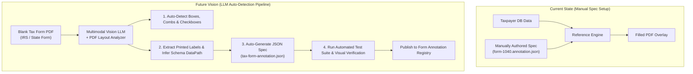

# Current State & Future Enhancements Vision

This document details the current capabilities of the **Tax Form Annotation Reference Engine** and outlines the primary future enhancement: **Automated LLM-Driven Form Field Detection & Annotation Spec Generation**.

---

## 1. Current State (Prototype Architecture)

Currently, the engine operates on pre-defined form coordinate templates:
1. **Stored Taxpayer Data**: Taxpayer information is retrieved from an existing database (relational SQL or NoSQL document store) and projected into a structured object graph.
2. **Manual Field Mapping**: A human author or tax analyst manually defines a `tax-form-annotation.json` spec per tax form, mapping database `dataPath` strings to exact PDF bounding box coordinates and layout strategies (`CHARACTER_SLICE`, `MULTI_LINE_WRAP`, etc.).
3. **PDF Overlay Rendering**: The engine executes sub-50ms overlays to render taxpayer data onto blank PDF pages.

### Current Limitations
While highly reliable and pixel-perfect, setting up annotations currently requires manually creating a spec file for **every single form** across federal, state, and municipal tax jurisdictions.

---

## 2. Future Vision: Automated LLM Form Field Auto-Detection

To scale from tens of forms to thousands of federal, state, and municipal tax forms, the next major evolution is **LLM-Powered Auto-Annotation Generation**.

### Detailed Feature Breakdown: LLM Form Auto-Detection

1. **Multimodal Vision & Layout Parsing**:
   * Blank tax form PDFs are processed using Multimodal LLMs (e.g., GPT-4o, Gemini 1.5 Pro, Claude 3.5 Sonnet) combined with PDF layout engine extraction.
   * The model auto-detects physical visual components: single text boxes, segmented comb cell grids (`[___]-[__]-[____]`), and checkbox fields.

2. **Semantic Label Extraction & Data Path Inferencing**:
   * The LLM reads printed form text labels (e.g. *"1a Total wages, tips, other compensation"*, *"Your social security number"*).
   * It infers the corresponding standard taxpayer schema property path (e.g., `income.w2[0].wages`, `taxpayer.primary.identity.ssn`).

3. **Automated Annotation Spec Output**:
   * Outputs a fully validated, schema-compliant `tax-form-annotation.json` file for any new or revised tax form without human coding.

4. **Automated Unit Test & Verification Generation**:
   * Auto-generates mock taxpayer payloads and unit tests to verify layout alignment, character comb partitioning, and font shrink-to-fit behavior before deploying to production.
