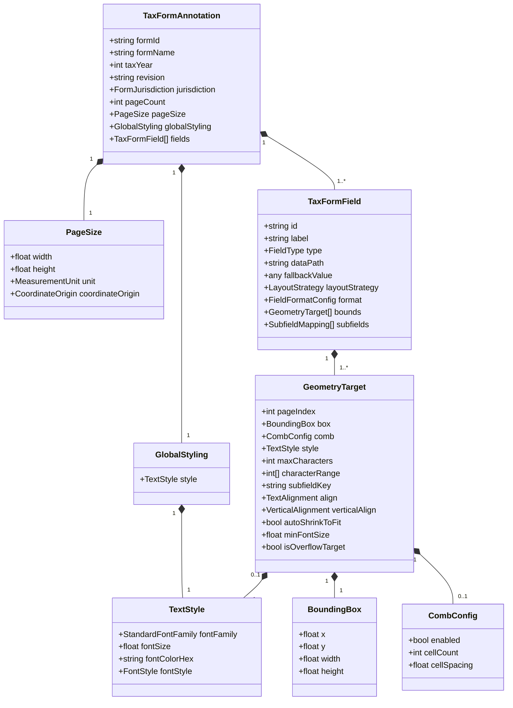
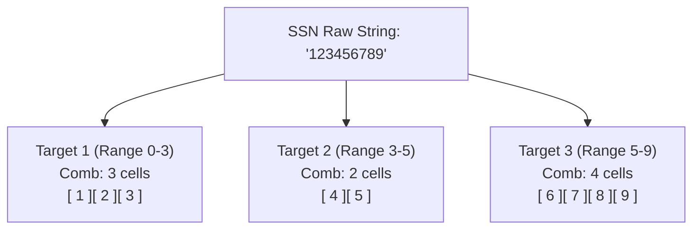
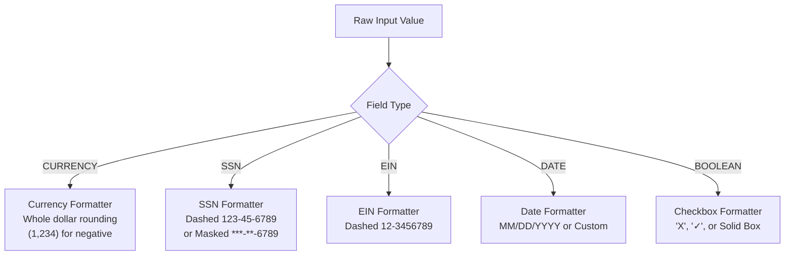

# U.S. Tax Form Annotation Specification

**Version:** 1.0.0  
**Schema Standard:** [JSON Schema (Draft 2020-12)](https://json-schema.org/draft/2020-12/json-schema-core.html) & Strict TypeScript Interfaces  
**Target Engine:** Pure TypeScript Zero-Binary PDF Overlay Engine (`pdf-lib`)

---

## 1. Executive Summary & Core Assumptions

This specification defines a declarative data contract for annotating physical boxes, lines, tables, and grids on U.S. tax forms (such as [IRS](https://www.irs.gov/) Form 1040, Form W-2, and Schedules).

It solves four primary engineering challenges:
1. **Multi-Segment Geometry**: Connects a single logical data field to multiple non-contiguous boxes, split date/time fields, character comb grids, or wrapped text lines.
2. **Nested Data Resolution**: Pulls values directly from deeply nested object payloads using dot notation, array indices, and filter predicates like `income.schedules[?(@.type=="C")].netProfit` (see [RFC 9535 JSONPath Filter Selectors](https://www.rfc-editor.org/rfc/rfc9535.html#name-filter-selectors) and [JSONPath Documentation](https://goessner.net/articles/JsonPath/)).
3. **IRS Formatting Rules**: Formats currency with whole-dollar rounding and negative parentheses `(1,234)`, dashes/masks [Social Security Numbers (SSNs)](https://www.irs.gov/individuals/understanding-your-ssn) and [Employer Identification Numbers (EINs)](https://www.irs.gov/businesses/small-businesses-self-employed/employer-id-number-ein), formats dates, and auto-shrinks font sizes to prevent text clipping.
4. **Platform Independence**: Defined via [JSON Schema Draft 2020-12](https://json-schema.org/draft/2020-12/json-schema-core.html) for complete language portability across TypeScript, Python, Go, and Java.

### Key Assumptions & Storage Agnosticism
* **Nested Data Assumption**: Taxpayer input data is assumed to be structured as a nested object payload (typically serialized in JSON).
* **Database Agnosticism**: The specification is entirely database-agnostic. The `dataPath` resolution layer operates on an abstract property-path contract (`taxpayer.primary.identity.ssn`). Whether the underlying data source is a relational database (SQL via PostgreSQL `JSONB`, MySQL, SQLite, or ORM entity projections), a NoSQL document database (MongoDB, DynamoDB), or a Key-Value store, the data provider simply serializes or projects records into the target object graph before resolution.

---

## 2. Core Data Structure Model

The class-based structure of the annotation specification is defined using standard UML class modeling (rendered responsively via Mermaid):



---

## 3. Layout Strategies & Geometry Rules

IRS tax forms rarely place inputs inside simple single boxes. Fields split across physical boxes, comb grids, or wrapped lines. The specification handles this using five layout strategies within `bounds: GeometryTarget[]`.

### Strategy 1: `CHARACTER_SLICE` (Segmented Comb Boxes)
* **Analogy**: Like filling out a crossword grid where each square holds exactly one character.
* **Use Case**: [Social Security Numbers (SSNs)](https://www.ssa.gov/ssnumber/) and [Employer Identification Numbers (EINs)](https://www.irs.gov/businesses/small-businesses-self-employed/employer-id-number-ein) split into `3-2-4` boxes separated by printed dashes: `[___] - [__] - [____]`.
* **Behavior**: The engine partitions the raw string using character ranges (`[0, 3]`, `[3, 5]`, `[5, 9]`) and centers each character inside its individual comb cell.

$$\text{cellX} = x_{\text{box}} + i \cdot (\text{width}_{\text{cell}} + \text{spacing}) + \frac{\text{width}_{\text{cell}} - \text{width}_{\text{char}}}{2}$$



### Strategy 2: `MULTI_LINE_WRAP` (Disjoint Text Wrap)
* **Analogy**: Like pouring water from a pitcher into a set of connected glasses—when the first fills up, the rest flows into the next glass.
* **Use Case**: Street addresses or legal descriptions that span multiple separate physical lines on the tax form.
* **Behavior**: Text fills Box 1 up to `maxCharacters` on word boundaries, then flows into Box 2, Box 3, etc.

### Strategy 3: `SUBFIELD_MAPPING` (Composite Data Splitting)
* **Analogy**: Taking a combined timestamp like `2026-04-14T15:45:00Z` and putting the date on the front door and the time on the back door.
* **Use Case**: E-signature blocks requiring Date (`04/14/2026`) and Time (`03:45 PM`) in separate boxes on the page.
* **Behavior**: Evaluates transforms (`DATE_PART`, `TIME_PART`) and routes each value to the matching `GeometryTarget.subfieldKey`.

### Strategy 4: `OVERFLOW_CHAIN` (Continuation Overflow)
* **Analogy**: Overflow parking—when the main parking lot is full, cars park in the auxiliary lot.
* **Use Case**: Text or line items exceeding primary form box boundaries.
* **Behavior**: Excess characters flow into secondary memo boxes or trigger a standardized continuation schedule attachment.

### Strategy 5: `SINGLE_BOX` (Standard Input)
* **Analogy**: A standard name tag sticker.
* **Use Case**: Single-line text, currency amounts, or checkboxes with alignment (`LEFT`, `CENTER`, `RIGHT`) and auto-shrink typography.

### Typography, Font Styling & Auto-Shrink Rules
To handle real-world text sizing and presentation variance, typography settings are configured at both the global level (`GlobalStyling`) and per-box target level (`GeometryTarget`):

1. **Multiline Text Support**:
   * Supported via `LayoutStrategy.MULTI_LINE_WRAP` (flowing text across multiple physical line boxes) and internal line breaking with vertical alignment (`verticalAlign: TOP | MIDDLE | BOTTOM`).
2. **Dynamic Font Shrink-to-Fit**:
   * Configured via `autoShrinkToFit: true` and `minFontSize: 6` (default minimum font size in points).
   * If input text exceeds the physical box width or line bounds, the rendering engine automatically scales down font size incrementally until the text fits cleanly inside the box boundaries without clipping.
3. **Font Styling & Variant Options**:
   * **Font Families & Weights**: Configured via `fontFamily: StandardFontFamily` (`Helvetica`, `Helvetica-Bold`, `Courier`, `Times-Roman`). Bold and Italic formatting in standard PDF engine specifications are represented via explicit font face variants (`Helvetica-Bold`, `Times-Bold`, `Times-Italic`).
   * **Font Colors**: Configured via `fontColorHex` (e.g., `#000000` for default black ink or custom colors).

---

## 4. Data Path Resolution Rules

Taxpayer data is provided as a structured object graph (SQL projection or NoSQL document). The path resolver extracts values using four lookup rules:

| Rule | Syntax Example | Documentation Link & Behavior |
| :--- | :--- | :--- |
| **Dot Navigation** | `taxpayer.primary.identity.ssn` | Navigates nested object properties. |
| **Array Indexing** | `taxpayer.dependents[0].firstName` | Accesses specific array elements by 0-based index. |
| **Filter Query** | `income.schedules[?(@.type=="C")].netProfit` | Matches array items using [RFC 9535 Filter Selectors](https://www.rfc-editor.org/rfc/rfc9535.html#name-filter-selectors). |
| **Fallback Handling** | `fallbackValue: "0.00"` | Returns default value when path resolves to null or undefined. |

---

## 5. IRS Tax Formatting Pipeline

Formatting rules conform to standard [IRS Guidelines](https://www.irs.gov/forms-instructions) across currency, identity numbers, dates, and boolean selections:



---

## 6. Complete Specification Schema Example

Below is a complete instance compliant with [JSON Schema (Draft 2020-12)](https://json-schema.org/draft/2020-12/schema):

```json
{
  "$schema": "https://json-schema.org/draft/2020-12/schema",
  "formId": "IRS-1040",
  "formName": "U.S. Individual Income Tax Return",
  "taxYear": 2025,
  "revision": "Rev. December 2025",
  "pageCount": 2,
  "pageSize": {
    "width": 612,
    "height": 792,
    "unit": "pt",
    "coordinateOrigin": "TOP_LEFT"
  },
  "fields": [
    {
      "id": "f1040_primary_ssn",
      "label": "Your social security number",
      "type": "SSN",
      "dataPath": "taxpayer.primary.identity.ssn",
      "layoutStrategy": "CHARACTER_SLICE",
      "format": { "ssn": { "format": "RAW" } },
      "bounds": [
        {
          "pageIndex": 0,
          "characterRange": [0, 3],
          "box": { "x": 440, "y": 95, "width": 36, "height": 14 },
          "comb": { "enabled": true, "cellCount": 3 }
        },
        {
          "pageIndex": 0,
          "characterRange": [3, 5],
          "box": { "x": 484, "y": 95, "width": 24, "height": 14 },
          "comb": { "enabled": true, "cellCount": 2 }
        },
        {
          "pageIndex": 0,
          "characterRange": [5, 9],
          "box": { "x": 516, "y": 95, "width": 48, "height": 14 },
          "comb": { "enabled": true, "cellCount": 4 }
        }
      ]
    }
  ]
}
```

